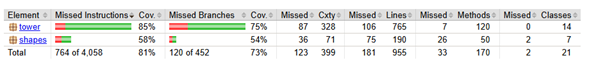
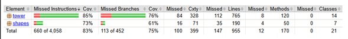

# 📊 PROYECTO-DOPO — Reporte de Cobertura de Tests
> 👥 Autores: Julian & Sergio Buitrago  
> 🛠️ Herramientas: **JaCoCo 0.8.11** · **JUnit 5** · **Maven**
---
## 📌 Estado Inicial
| Paquete | Instrucciones cubiertas | Ramas cubiertas | Métodos sin cubrir | Clases sin cubrir |
|---------|------------------------|-----------------|-------------------|-------------------|
| `tower` | 58% | 50% | 46 de 120 | 6 de 14 |
| `shapes` | 56% | 45% | 26 de 50 | 2 de 7 |
| **Total** | **57%** | **50%** | **74 de 172** | **9 de 22** |
### Observaciones iniciales
- La cobertura general del **57%** estaba por debajo del estándar recomendado del 80%.
- El paquete `tower`, siendo el núcleo del sistema, tenía 185 instrucciones sin cubrir y **6 clases completamente sin tests**.
- El paquete `shapes` presentaba una situación similar con el 56% de cobertura y 2 clases sin ninguna prueba.
- De 172 métodos totales, **74 (43%) no tenían ninguna prueba asociada**.
- La cobertura de ramas al 50% indicaba que la mayoría de los condicionales del sistema no estaban siendo ejercitados.
---
## ✅ Estado Final (V1)

| Paquete | Instrucciones cubiertas | Ramas cubiertas | Métodos sin cubrir | Clases sin cubrir |
|---------|------------------------|-----------------|-------------------|-------------------|
| `tower` | 85% | 75% | 7 de 120 | 0 de 14 |
| `shapes` | 58% | 54% | 26 de 50 | 2 de 7 |
| **Total** | **81%** | **73%** | **33 de 170** | **2 de 21** |
### Observaciones finales
- El paquete `tower` alcanzó **85% de instrucciones** y **75% de ramas**, con **0 clases sin cobertura** — una mejora sólida sobre el estado inicial.
- El paquete `shapes` mejoró levemente en ramas (45% → 54%), aunque aún mantiene 2 clases sin cubrir.
- La cobertura general superó el umbral del **80%**, pasando de 57% a **81% de instrucciones**.
- Se eliminó la clase `org.example` del análisis, que anteriormente arrastraba un 0% de cobertura.
---
## 📈 Comparativa: Antes vs Después
| Métrica | Estado inicial | Estado final | Variación |
|---------|---------------|--------------|-----------|
| Cobertura de instrucciones | 57% | **81%** | +24 pp ✅ |
| Cobertura de ramas | 50% | **73%** | +23 pp ✅ |
| Instrucciones sin cubrir | 1,717 de 4,065 | **764 de 4,058** | −953 ✅ |
| Métodos sin cubrir | 74 de 172 | **33 de 170** | −41 ✅ |
| Clases sin cubrir | 9 de 22 | **2 de 21** | −7 ✅ |

| Paquete | Instrucciones cubiertas | Ramas cubiertas | Métodos sin cubrir | Clases sin cubrir |
|---------|------------------------|-----------------|-------------------|-------------------|
| `tower` | 85% | 76% | 8 de 120 | 0 de 14 |
| `shapes` | 73% | 61% | 4 de 50 | 0 de 7 |
| **Total** | **83%** | **75%** | **12 de 170** | **0 de 21** |

> **Nota:** En esta segunda medición se añadieron tests sobre el paquete `shapes` (`Circle`, `Rectangle`, `Triangle` y su jerarquía base `Shape`) con el objetivo de elevar su cobertura. Las pruebas no validan lógica de negocio propia de `shapes`, sino que ejercitan los getters, setters de posición y color, y los métodos de movimiento, cuya correctitud ya está implícita en el funcionamiento visual del sistema. El resultado fue una mejora de **58% → 73%** en instrucciones y **54% → 61%** en ramas, eliminando las 2 clases que quedaban sin cobertura.

---
## 🔍 Resumen General
El proyecto logró una mejora significativa en su cobertura de tests, pasando del **57% al 83%** de instrucciones cubiertas y del **50% al 75%** en cobertura de ramas. Se redujeron los métodos sin prueba de 74 a **12** (una reducción del 84%) y las clases sin cobertura de 9 a **0**.

El paquete `tower`, que es el núcleo del sistema, pasó de tener 6 clases sin cobertura a **ninguna**, consolidándose como el paquete mejor cubierto del proyecto. El paquete `shapes` cerró también con **0 clases sin cobertura** tras la incorporación de tests dirigidos a sus componentes gráficos básicos.
